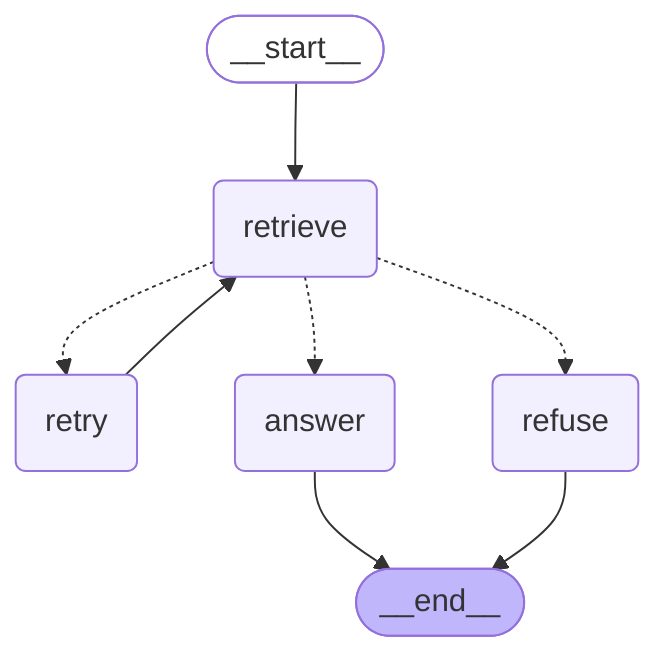
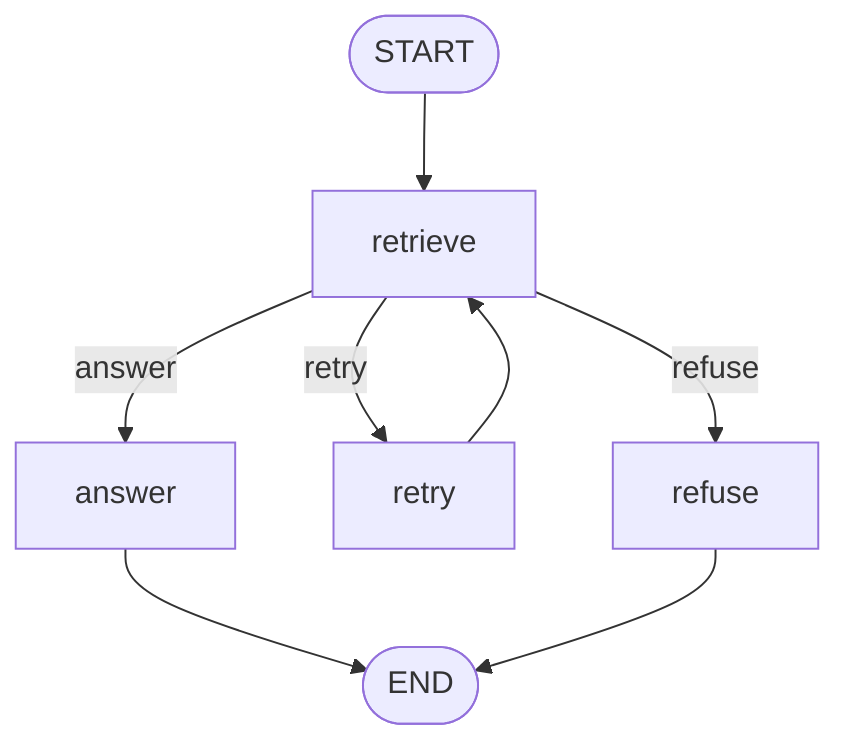

#  RAG Assistant as a LangGraph Agent

```mermaid
graph TD;
        __start__([<p>__start__</p>]):::first
        retrieve(retrieve)
        retry(retry)
        answer(answer)
        refuse(refuse)
        __end__([<p>__end__</p>]):::last
        __start__ --> retrieve;
        retrieve -.-> answer;
        retrieve -.-> refuse;
        retrieve -.-> retry;
        retry --> retrieve;
        answer --> __end__;
        refuse --> __end__;
        classDef default fill:#f2f0ff,line-height:1.2
        classDef first fill-opacity:0
        classDef last fill:#bfb6fc
```

```mermaid
graph TD
    START([START]) --> retrieve[retrieve]

    retrieve -->|answer| answer[answer]
    retrieve -->|retry| retry[retry]
    retrieve -->|refuse| refuse[refuse]

    retry --> retrieve

    answer --> END([END])
    refuse --> END
```